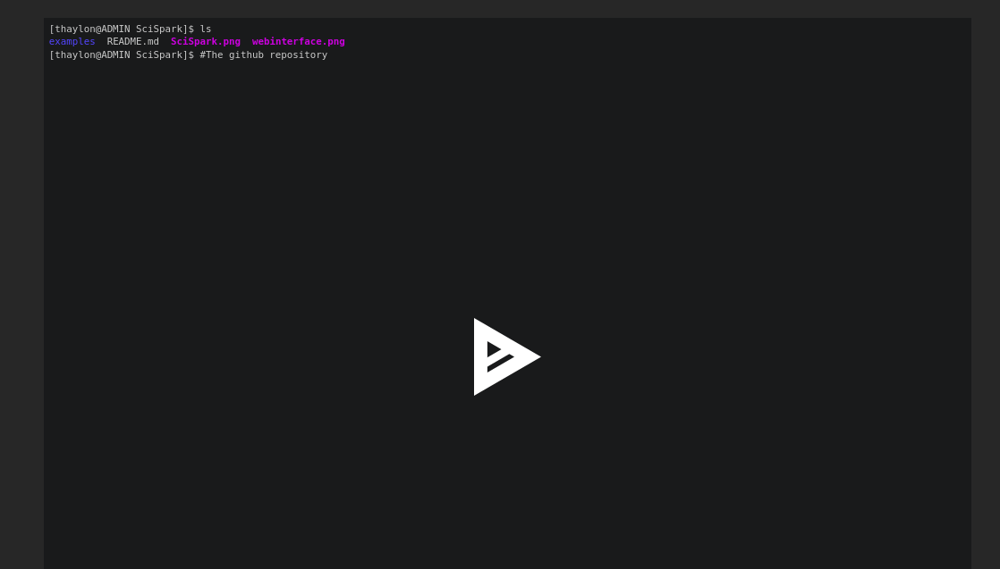

# SAMbA - SciPhy Reproducible Example

## Running the SciPhy Workflow

This repository includes all the files you need to reproduce the example showed in our [demonstration video (see below)](https://github.com/UFFeScience/SambA-SciPhy#a-session-recorded).

To execute this scientific workflow, you need a Docker container running in your current folder.
If you don't have the SAMbA Docker image, you can pull it from [here](https://github.com/UFFeScience/SAMbA#download-docker-image).

After saving the Docker image in the current folder, run the following command in your shell-like environment to start the SAMbA container:

```bash
docker run --cap-add mknod --cap-add sys_admin --device=/dev/fuse  \
       --privileged --rm -it -p 8000:8000 -p 9042:9042 \
       -v "$PWD/repository:/SAMbAFiles/SAMbA/gitblit/data/git" \
       -v "$PWD/database:/SAMbAFiles/apache-cassandra/data" \
       -v "$PWD:/home/samba/workspace" thaylongs/samba
```

After booting the container, clone this repo and then go to "SourceCode" directory to run the following commands:

```bash
cd $WORKSPACE
git clone https://github.com/UFFeScience/SambA-SciPhy.git
cd SourceCode
sh build.sh
sh submit.sh
```

If you want to change the inputs, you can change it in the ```submit.sh``` bash script changing the top of file entry with a command as:

``` bash
echo NAME;FASTA_FILE > inputList.txt$
echo "FILE_NAME;$WORKSPACE/inputs/FILE_NAME" >> inputList.txt
```

where ```FILE_NAME``` is the file name of the file that you want to add.
You can find all the original and reproducible inputs in the ```inputs/``` folder.
The web-based SAMbA-RaP dashboards will be available in your browser at ```https://localhost:8000```.

## A session recorded

The video below shows the sequence of commands you need to reproduce this workflow once the repository was already cloned.

*Note:* we renamed the Source Code directory to SourceCode (*no space in between*) to avoid possible conflicts of reserved characters.

<a href="https://asciinema.org/a/ndWMECaBxT9Sdld8DuCp04fHO" target="_blank">




</a>


